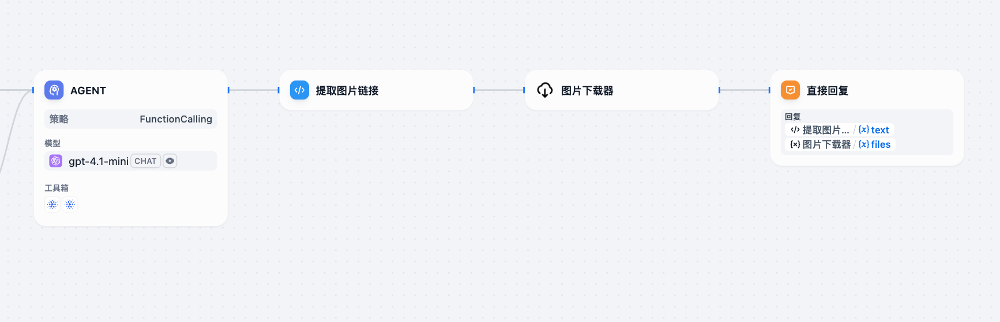

# 图片下载器 (Image Downloader)

一个简单而高效的图片下载 Dify 插件，可以从 URL 下载图片并将其作为 blob 返回。

## 功能特点

- 支持从任何公开的 URL 下载图片
- 自动检测图片类型并设置正确的 MIME 类型
- 支持常见图片格式（JPG、PNG、GIF、BMP、WebP 等）
- 简单易用的接口
- 解决了 Dify 云版本（udify.app）的 CSP 问题，允许显示来自外部域名的图片

## 安装方式

1. 从 [Dify Marketplace](https://marketplace.dify.ai/plugins) 安装插件
2. 导航到 Dify 工作区中的**插件**部分
3. 找到"图片下载器"插件并点击"安装"
4. 安装完成后，你可以在应用程序中使用该插件

### 添加到应用程序

1. 创建或编辑一个 Chatflow 或 Workflow 应用
2. 在工具选择面板中，选择"图片下载器"工具
3. 根据需要在应用流程中配置工具
4. 保存并发布应用

## 使用方法

这个插件允许你通过提供图片 URL 来轻松下载图片。

### 参数

- `image_url`（必需）：要下载的图片的 URL

## 示例用法

基本用法：
```
提供图片 URL，插件将下载并返回图片。
URL: https://example.com/image.jpg
```

实际应用场景：

如下图所示，LLM 在回复中输出了 Markdown 格式的图片链接，但由于 CSP 限制，这些外部图片无法直接显示。可以使用以下代码从 LLM 回复中提取图片 URL，再通过本插件下载图片并展示。

```python
import re
from typing import Dict

def main(text: str) -> Dict[str, str]:
    # 匹配 Markdown 图片语法：
    match = re.search(r'!\[.*?\]\((https?://[^\s)]+)\)', text)
    url = match.group(1) if match else ""

    # 去掉图片部分
    text_without_image = re.sub(r'!\[.*?\]\((https?://[^\s)]+)\)', '', text)

    return {
        "text": text_without_image.strip(),
        "url": url
    }
```

上述代码可以在 Dify Workflow 中作为 Python 运行时节点使用，提取图片 URL 后传给图片下载器插件，解决 CSP 限制问题。



## 解决的问题

这个插件解决了 Dify 云版本（udify.app）中的内容安全策略（CSP）限制问题。当 AI 需要展示来自外部域名的图片时，由于 CSP 限制，这些图片默认无法显示。该插件通过先下载图片，然后通过 blob 方式返回，绕过了 CSP 的限制，使外部图片能够正常显示。

在未使用本插件时，尝试加载外部图片会遇到类似下面的 CSP 错误：

```
Refused to load the image '...' because it violates the following Content Security Policy directive: "img-src 'self' data: mediastream: blob: filesystem: 'nonce-MDdlNWNlZjYtMzg0MS00ZjI0LTk0ZDAtNWZiNzM5ZjQwNmM3' *.dify.ai *.udify.app udify.app .cloudflareinsights.com .sentry.io http://localhost: http://127.0.0.1: analytics.google.com googletagmanager.com *.googletagmanager.com google-analytics.com api.github.com".
```

相关问题可参考：[Dify Issue #9878](https://github.com/langgenius/dify/issues/9878)

## 开发者信息

- **作者**: lzfxxx
- **版本**: 0.0.1
- **类型**: 工具插件

## 反馈和问题

如果你遇到任何问题或有建议，请在 [GitHub 仓库](https://github.com/lzfxxx/image-downloader) 提交 issue。


